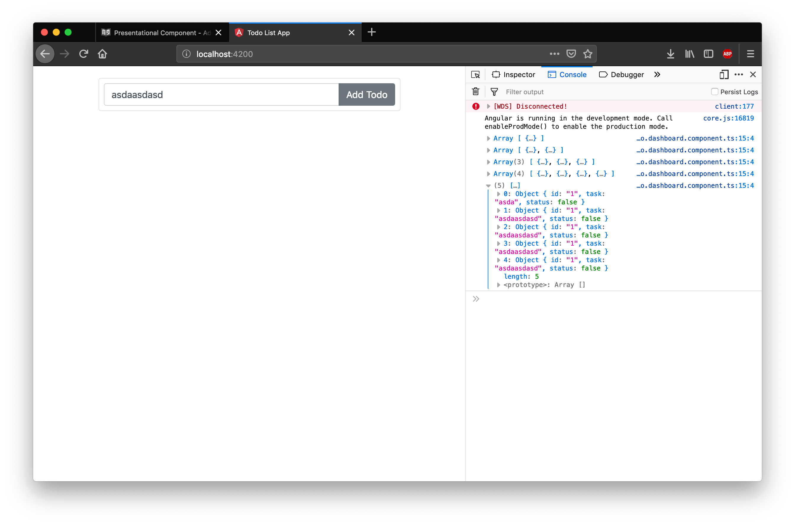

# Add Todo Component

Selanjutnya kita akan menyelesaikan langkah selanjutnya yaitu membuat presentational component AddTodoComponent. Presentational component ini mempunyai tugas menerima input dari user untuk disimpan sebagai Item Todo. Untuk menyelesaikan component ini lakukanlah langkah percobaan dibawah ini.

Sesuai dengan desain pada chapter sebelumnya berdasarkan tabel dibawah ini

| Component          |  Input   | Output / Event Emitter |
| ------------------ | :------: | ---------------------: |
| TodoCountComponent | Todos[ ] |                      - |
| TodoItemComponent  |   Todo   |         ToggleFinished |
| AddTodoComponent   |    -     |                AddTodo |

AddTodoComponent memiliki output / event emitter yang bertujuan untuk menambahkan Todo. Selanjutnya mari kita isi file component yang sebelumnya sudah di buat pada file `add.todo.component.ts`. Bukalah file tersebut kemudian tambahkan import yang menjadi syarat untuk membuat sebuah file menjadi component.

```typescript
import { Component} from '@angular/core';
```
Component di import agar kita dapat menggunakan decorator @component. Kemudian kita dapat menggunakan decorator @Component.

```typescript
@Component({
  selector: 'add-todo',
  styleUrls: [],
  templateUrl: 'add.todo.html'
})
```
Pada kode program diatas kita menggunakan decorator @Component kemudian menggunakan selector, styleUrls dan templateUrl seperti pada kode program di atas. Dengan decorator diatas kita dapat menggunakan tag `<add-todo></add-todo>` di template html, untuk component ini tidak digunakan style dan template nya di pisah di file `add.todo.html`.

Selanjutnya setelah decorator buatlah class typescript dengan nama `AddTodoComponent` 

```typescript
export class AddTodoComponent {
  constructor() {}
}
```
Di kode program di atas kita membuat sebuah class typescript dengan nama `AddTodoComponent`, penting untuk diperhatikan ada statement export sebelum class ini diperlukan agar class ini dapat di import di file lain, jika tidak ada statement ini class ini tidak dapat di import dari file lain.

Selanjutnya lengkapilah file `add.todo.html`, di file ini kita isikan tampilan dari component add todo yang kita buat sebelumnya. 

```html
<form class="card p-2 todo-input" target="#">
  <div class="input-group">
    <input
      type="text"
      class="form-control"
      placeholder="Add Your Todo List Here"
    />
    <div class="input-group-append">
      <button
        type="submit"
        class="btn btn-secondary"
      >
        Add Todo
      </button>
    </div>
  </div>
</form>
```

Setelah menambahkan file html ini selanjutnya kita harus melakukan registrasi component `add.todo.component.ts` ke module `TodoDashboard`, untuk melakukannya dapat dilakukan dengan mengimport `add.todo.component` kemudian menjadikannya sebagai declarations pada module `TodoDashboard`. Tambahkan kode program dibawah ini untuk mengimport `add.todo.component`. 

```typescript
import { AddTodoComponent } from './component/add-todo/add.todo.component';
```

```typescript
@NgModule({
  declarations: [TodoDashboardComponent, AddTodoComponent],
  imports: [CommonModule],
  exports: [TodoDashboardComponent]
})
```

Selanjutnya bukalah kembali file `todo.dashboard.html` dan hapuslah komentar untuk selector `add-todo` sehingga kode program pada file ini menjadi seperti dibawah ini.
```html
<div class="row">
  <div class="col-md-12 order-md-2 mb-4">
    <add-todo></add-todo>
    <!-- <todo-count></todo-count>
    <todo-item></todo-item> -->
  </div>
</div>
```

Jika semua kode program diketikkan dengan benar akan didapatkan tampilan seperti dibawah ini jika server dijalankan: 


Sejauh ini kita sudah berhasil memindahkan tampilan untuk menambah todo ke AddTodoComponent namun ketika di klik tombol add todo aplikasi masih tidak berjalan, ingat di awal bahwa AddTodoComponent memiliki output dengan EventEmitter bernama AddTodo.

Selanjutnya untuk menambahkan output dan memastikan AddTodoComponent bekerja dengan baik lakukanlah langkah langkah berikut. 

### Update TodoDashboard untuk menerima output

Langkah pertama yang dilakukan adalah menambahkan sebuah custom event pada file todo.dashboard.html dimana pada file ini terdapat selector `<add-todo></add-todo>`. Custom event ini akan digunakan sebagai output dari `AddTodoComponent`, custom event pada dasarnya sama dengan event binding biasa namun pada custom event kita dapat memberikan nama sesuai dengan kebutuhan kita. Ubahlah file `todo.dashboard.html` menjadi seperti dibawah ini.

```html
<div class="row">
  <div class="col-md-12 order-md-2 mb-4">
    <add-todo (create)="handleAddTodo($event)"></add-todo>
    <!-- <todo-count></todo-count>
    <todo-item></todo-item> -->
  </div>
</div>
```

Kemudian tambahkan implementasi `handleAddTodo` pada file `todo.dashboard.component.ts`

```typescript
import { Component } from '@angular/core';
@Component({
  selector: 'todo-dashboard',
  styleUrls: ['todo.dashboard.css'],
  templateUrl: 'todo.dashboard.html'
})
export class TodoDashboardComponent {
  handleAddTodo(task: string) {
    console.log(task);
    return false;
  }
}
```

### Buat Template Ref
Bukalah kembali file `add.todo.html` pada pada folder `add-todo`, kemudian tambahkan template reference dengan nama task, sehingga kode program pada `add.todo.html` menjadi seperti ini : 

```html
<form class="card p-2 todo-input" target="#">
  <div class="input-group">
    <input
      type="text"
      class="form-control"
      placeholder="Add Your Todo List Here"
      #task
    />
    <div class="input-group-append">
      <button type="submit" class="btn btn-secondary">
        Add Todo
      </button>
    </div>
  </div>
</form>
```
### Buat Event Click 
Kemudaian buatlah event binding untuk click pada tombol add todo.
```html
<form class="card p-2 todo-input" target="#">
  <div class="input-group">
    <input
      type="text"
      class="form-control"
      placeholder="Add Your Todo List Here"
      #task
    />
    <div class="input-group-append">
      <button
        type="submit"
        class="btn btn-secondary"
        (click)="onClickAddTodo(task.value)"
      >
        Add Todo
      </button>
    </div>
  </div>
</form>
```
Pada kode program diatas ditambahkan event binding click pada button add todo dengan handler onClickAddTodo.

### Buat Function Handle Event Click
Setelah membuat event binding, lanjutkan dengan membuat handler function nya.

```typescript
import { Component } from '@angular/core';
@Component({
  selector: 'add-todo',
  styleUrls: [],
  templateUrl: 'add.todo.html'
})
export class AddTodoComponent {
  constructor() {}
  onClickAddTodo(value: string) {
    console.log(value);
    return false;
  }
}

```
Jika server dijalankan pada tahap ini sudah bisa menerima event click dan membaca serta menampilkan input dari user ke console browser. 

> Return false pada fungsi onClickAddtodo berfungsi untuk menghentikan proses klik sehingga tidak berpindah ke halaman baru.


### Buat Event Emmitter
Setelah berhasil mendeteksi perubahan data di click event pada AddTodoComponent, kita harus mengirim perubahan ini ke parent component TodoDashboardcomponent, pengiriman data ini dilakukan dengan menggunakan event emitter.

Tambahkan import Event Emitter dan Output dari @angular/core

```typescript
import { Component, EventEmitter, Output } from '@angular/core';
```

Setelah menambahkan import kita dapat menggunakan decorator @output dan membuat sebuah event emitter untuk mengirim data keluar dari AddTodoComponent ke TodoDashboardComponent.

```typescript
import { Component, EventEmitter, Output } from '@angular/core';
@Component({
  selector: 'add-todo',
  styleUrls: [],
  templateUrl: 'add.todo.html'
})
export class AddTodoComponent {
  @Output()
  create: EventEmitter<any> = new EventEmitter();

  constructor() {}

  onClickAddTodo(value: string) {
    this.create.emit(value);
    return false;
  }
}
```
Pada kode program diatas ditambahkan decorator @output untuk menandakan bahwa component ini memiliki output dengan nama create yang berupa sebuah event emitter. kemudain pada function onClickAddtodo dilakukan emit create event dengan nilai data dari input text.


### Update Event di TodoDashboard.html
Setelah data dikirim ke todo.dashboard.component kita dapat menggunakan data tersebut untuk merubah dan menambahkan data todo. Untuk menambah data todo lakukan perubahan berikut pada todo.dashboard.component.

Tambahkan import untuk model Todo sehingga dapat digunakan pada component ini.
```typescript
import { Todo } from '../models/todo.model';
``` 

Buatlah variabel todoList sebagai attribut component tododashboard

```typescript
todoList: Todo[] = [];
```

Ubah fungsi handle addtodo menjadi seperti berikut ini
```typescript
  handleAddTodo(task: string) {
    const itemTodo = new Todo('1', task, false);
    this.todoList.push(itemTodo);
    console.log(this.todoList);
    return false;
}
```
Pada kode program di atas dibuat sebuah item todo dan menambahkannya ke todoList.

Berikut ini kode program lengkapnya dari todo.dashboard.component.

```typescript
import { Component } from '@angular/core';

import { Todo } from '../models/todo.model';
@Component({
  selector: 'todo-dashboard',
  styleUrls: ['todo.dashboard.css'],
  templateUrl: 'todo.dashboard.html'
})
export class TodoDashboardComponent {
  todoList: Todo[] = [];

  handleAddTodo(task: string) {
    const itemTodo = new Todo('1', task, false);
    this.todoList.push(itemTodo);
    console.log(this.todoList);
    return false;
  }

}
```

Jika server dijalankan dapat dilihat di console bahwa data todo baru ditambahkan ke array todoList


