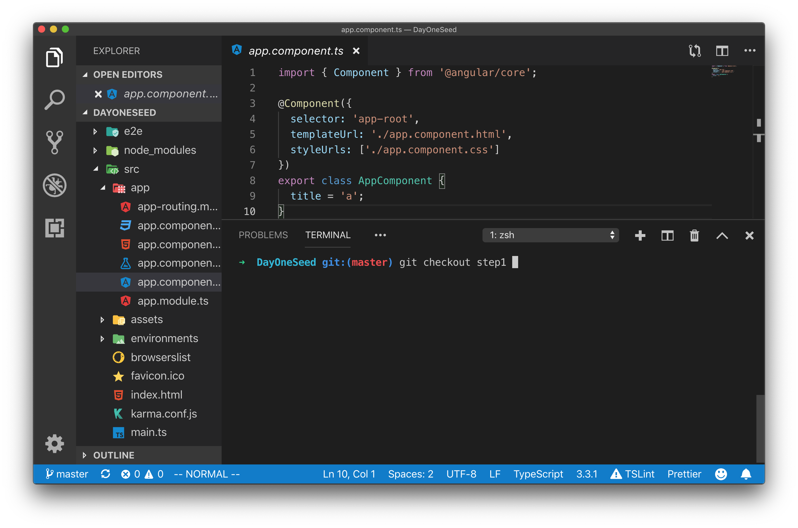
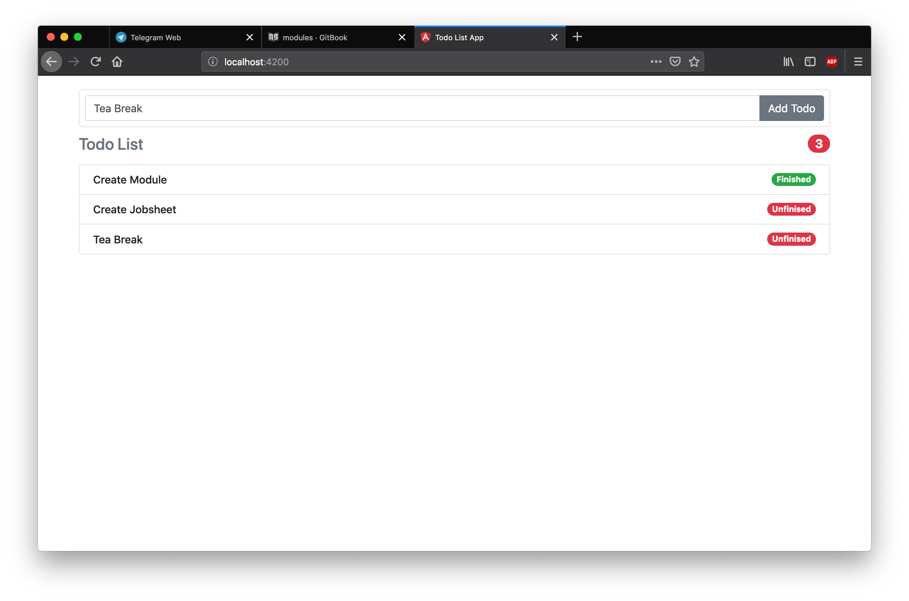

# Feature Modules

Feature modules adalah sebuah module yang berisi component component yang dibutuhkan untuk menyelesaikan suatu tugas atau suatu fitur. Pada percobaaan kali ini setelah anda berhasil memetakan mana yang menjadi Container Component dan mana yang menjadi Presentational Component akan dilanjutkan dengan membuat sebuah feature modules untuk TodoComponent, AddTodoComponent, TodoCountComponent, dan TodoItemComponent dalam sebuah Module TodoDashboard.

> A feature module is an organizational best practice, as opposed to a concept of the core Angular API. A feature module delivers a cohesive set of functionality focused on a specific application need such as a user workflow, routing, or forms. While you can do everything within the root module, feature modules help you partition the app into focused areas. A feature module collaborates with the root module and with other modules through the services it provides and the components, directives, and pipes that it shares.

## Langkah Percobaan

Clone lah repositori berikut ini dari github `https://github.com/siubie/DayOneSeed.git` kemudian bukalah menggunakan visual studio code dan switch dari branch `master` ke branch `step1` setelah berhasil mengganti branch jalankan server angular dengan perintah `ng serve` pastikan aplikasi todo yang ada sekarang berjalan dengan baik.

