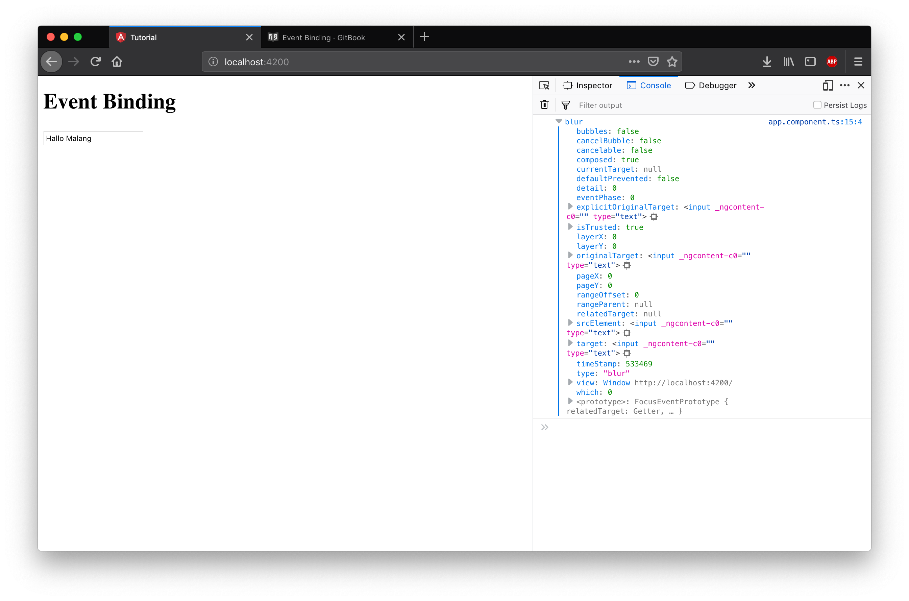
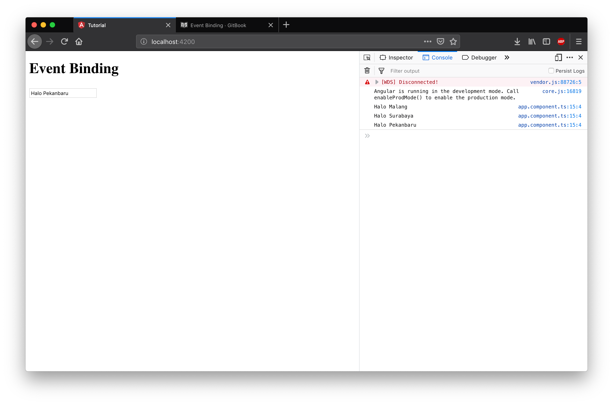
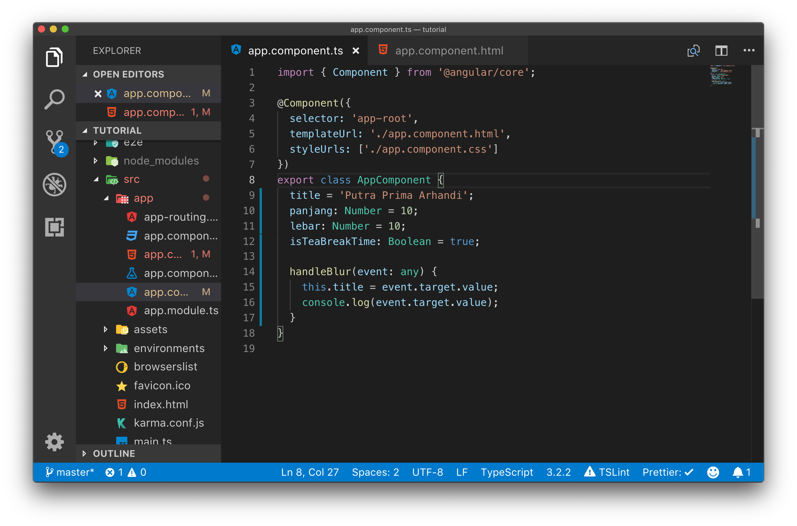
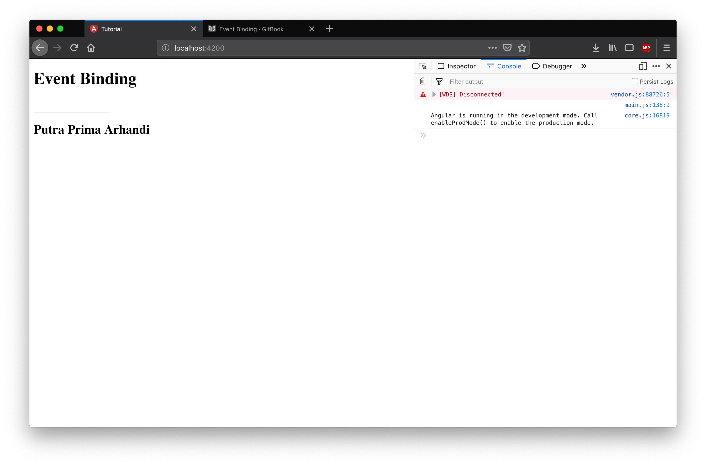
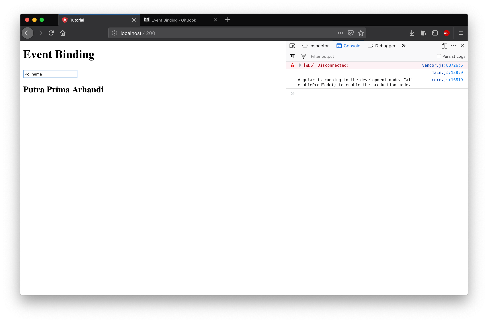
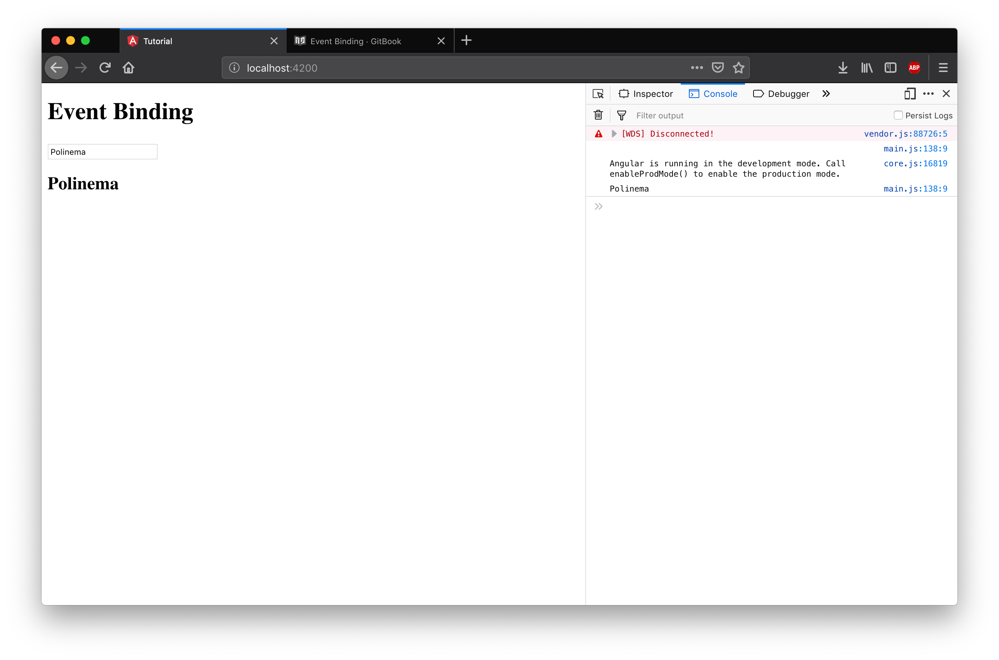

# Event Binding

Property binding bisa dugunakan untuk menampilkan data dari component ke template html, untuk menerima input / action dari user sebuah component dapat menggunakan Event Binding.

Event binding adalah binding yang khusus untuk event yang ada pada tag html yang ada pada template, contohnya jika pada template terdapat sebuah tag input maka event binding dapat di bind ke event onBlur, onInput, onChange, onFocus dan lain lain.

Untuk membuat event binding digunakan sintaks `()` yang di berikan sebuah fungsi pada class component.

## Langkah Praktikum

Hapuslah kode program pada file app.component.html yang ada dari percobaan sebelumnya, kemudian tambahkan kode program berikut ini.

Kemudian jalankan server angular dengan perintah `ng-serve --open` hasilnya akan seperti gambar dibawah ini.

Selanjutnya tambahkan eventBinding Angular onBlur pada tag input dengan cara menambahkan `(blur)=handleBlur($event)` pada input text di app.component.html.

Visual studio code akan menunjukkan error pada script di app.component.html itu dikarenakan kita belum membuat function handleBlur pada component class di app.component.ts. Selanjutnya buatlah fungsi handleBlur yang akan menghandle event tersebut pada class component.

Pada kode program di atas kita membuat sebuah function untuk menampilkan log ke console web browser setiap kali event onBlur dipanggil. Event onBlur / blur akan dipanggil setelah kita mengetik dan beranjak dari element input. Untuk menguji nya isikanlah sebuah text ke input text pada web browser kemudian klik di area diluar input text. Maka browser akan menampilkan log berisi nilai event yang di trigger oleh onBlur.

Didalam object event ini terdapat banyak properties, properties yang kita inginkan adalah event.target.value dimana properties tersebut merupakan text dari input yang kita isi. Untuk melihat apakah event.target.value merupakan properties yang kita inginkan ubahlah console.log pada app.component.ts menjadi seperti dibawah ini.

Hasil dari kode program di atas akan seperti gambar dibawah ini dimana setiap kali kita keluar dari input text maka pada console akan di log kan sebuah value berupa text yang kita inputkan.

Tentusaja melakukan sebuah log ke console tidak banyak manfaatnya untuk user, untuk menampilkan perubahan nilai dari input text ke user anda dapat menggunakan interpolasi atau property binding terhadap sebuah tag html di app.component.html untuk menampilkan text tersebut. Untuk mencoba hal ini kita menggunakan variabel title yang sudah ada pada component, kemudian mengubah nilainya sesuai dengan input dari user setiap kali user melakukan event blur. Sesuaikanlah isi dari file app.component.ts dan app.component.html anda seperti gambar dibawah ini.

Hasil dari kode program di atas adalah merubah nilai h2 pada app.component.html setiap kali kita melakukan event blur pada input text.

## Challenge Time

> Modifikasilah kode program di atas sehingga nilai title berubah setiap kali user mengetikkan text pada input.

> Modifikasi lah kode program di atas dengan membuatkan sebuah tombol untuk kembali me reset nilai variabel title kembali seperti semula (hints : button pada html mempunyai event onClick yang dapat di trigger menggunakan eventBinding (click))
