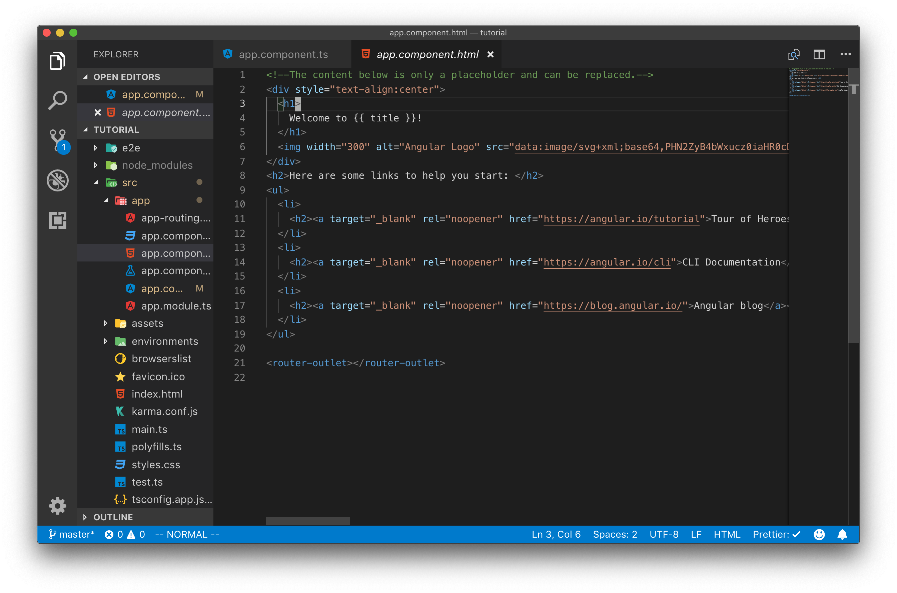

# Interpolasi

Angular menghubungkan antara data di class component dengan template html melalui sebuah proses interpolasi. Proses interpolasi ini dilakukan dengan menambahkan syntaks `{{ . }}` pada template html.

Contoh sederhana interpolasi yang sudah dilakukan pada percobaan sebelumnya adalah menghubungkan antara variabel `title` pada class dengan `{{title}}` pada template html.


Semua variabel yang telah di hubungkan (binding) antara class dengan templatenya dapat diperlakukan seperti sebuah variabel javascript contohnya dapat dilakukan penjumlahan atau proses lain yang dapat dilakukan pada variabel javascript.

## Langkah Praktikum

Pada file AppComponent.ts buatlah beberapa variabel baru dengan memperhatikan tipe datanya karena pada angular digunakan typescript.

```typescript
export class AppComponent {
  title = "Putra Prima Arhandi";
  panjang: Number = 10;
  lebar: Number = 10;
  isTeaBreakTime: Boolean = true;
}
```

Pada kode program diatas terdapat 4 variabel title, panjang, lebar, dan isTeaBreakTime. pada variabel title dibuat tanpa tipe data dan di isi data berformat string, untuk variabel panjang dan lebar di beri tipedata Number dan pada variabel isTeaBreakTime diberi tipe data Boolean.

Selanjutnya silahkan buka file app.component.html kemudian hapuslah semua isinya berikut ini tampilan awal file app.component.html



Hapuslah kode program diatas dan tambahkan kode program berikut ini :


```html
<h1>{{ title }}</h1>
<h2>Luas = {{ panjang }} x {{ lebar }} | {{ panjang * lebar }}</h2>
<h2>{{ isTeaBreakTime ? ":)" : ":(" }}</h2>
```

Berikut ini hasil jika anda mejalankan dengan benar :


