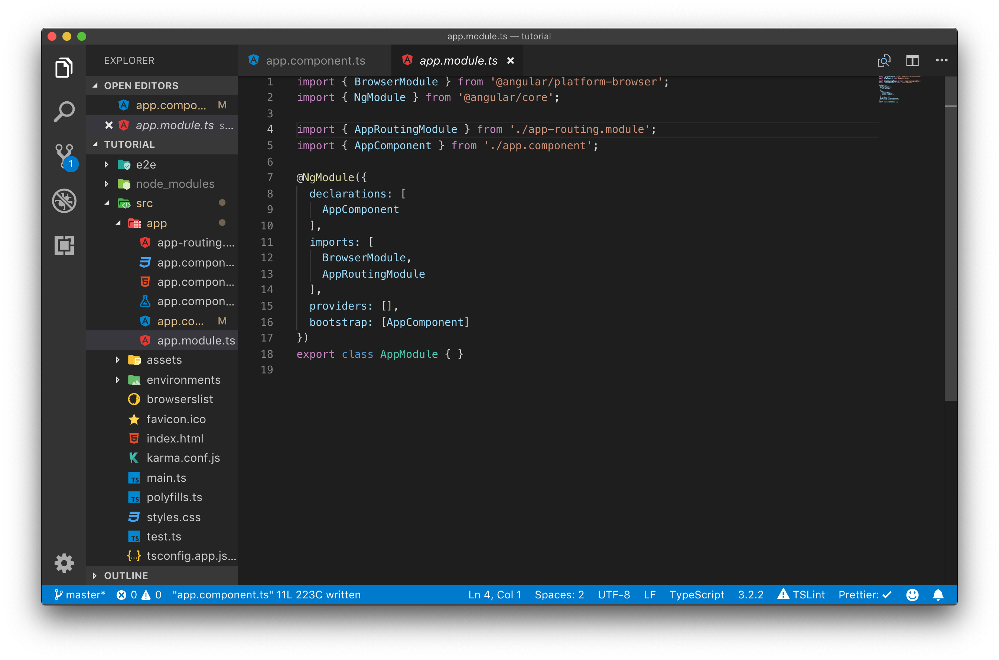

# Angular Modules

Angular memiliki sistem untuk membagi aplikasi menjadi bagian bagian kecil yang disebut module. Decorator yang digunakan untuk membuat sebuah module adalah NgModule. Module pada angular merupakan sebuah wadah yang menampung sekumpulan kode program baik component, service atau kode program lain yang bertugas menyelesaikan satu fitur atau satu domain aplikasi.

Setiap aplikasi angular minimal memiliki satu modules yang diberi nama AppModule, pada AppModule ini lah di lakukan bootstrapping untuk memulai aplikasi angular.

Sebuah aplikasi boleh memiliki lebih dari satu module penambahan module ini tergantung pada desain dan cara pengembangan aplikasi, dengan syarat semua module baru harus di includekan pada AppModule sebagai "child" dari AppModule.

Berikut ini contoh kode program AppModule :



## Langkah Percobaan

Perhatikan pada file AppModule.ts tetap ditambahkan beberapa statement import, yaitu BroweserModule,NgModule,AppRoutingModule dan AppComponent.

```typescript
import { BrowserModule } from "@angular/platform-browser";
```

statement diatas digunakan untuk mengimport BrowserModule, module ini diperlukan untuk pengembangan aplikasi angular yang berbasis web.

```typescript
import { NgModule } from "@angular/core";
```

Statement import diatas digunakan untuk mengimport Decorator NgModule, ini diperlukan untuk membuat sebuah class sebagai Module.

```typescript
import { AppRoutingModule } from "./app-routing.module";
```

Statement ini digunakan untuk mengimport Routing Module ini digenerate otomatis oleh angular cli ketika kita memilih opsi Y ketika membuat project di chapter awal.

```typescript
import { AppComponent } from "./app.component";
```

Statement ini digunakan untuk megimport component AppComponent, jika nanti kita menambahkan component baru maka kita harus menambahkan statement import terhadap component tersebut agar dapat digunakan oleh angular.

```typescript
@NgModule({
  declarations: [
    AppComponent
  ],
  imports: [
    BrowserModule,
    AppRoutingModule
  ],
  providers: [],
  bootstrap: [AppComponent]
})
```

Statement diatas adalah Decorator @NgModule yang didapat dari import NgModule dari @angular/core. Decorator ini memiliki beberapa meta data yaitu declarations, exports, imports, providers dan bootstraps.

1. Metadata declarations berisi semua component, directives ,dan pipes yang dimiliki oleh module bersangkutan. Setiap kali kita menambahkan component directive ataupun pipes maka semuanya harus di import dan di tambahkan ke declarations.
2. Metadata exports berisi nama module yang dapat digunakan oleh ngModule lain.
3. Metadata imports berisi module lain yang dibutuhkan oleh component yang ada pada module ini.
4. Metadata providers biasanya berisi service yang dibutuhkan oleh module bersangkutan.
5. Metadata bootstrap metadata khusus yang hanya dimiliki oleh root module.
