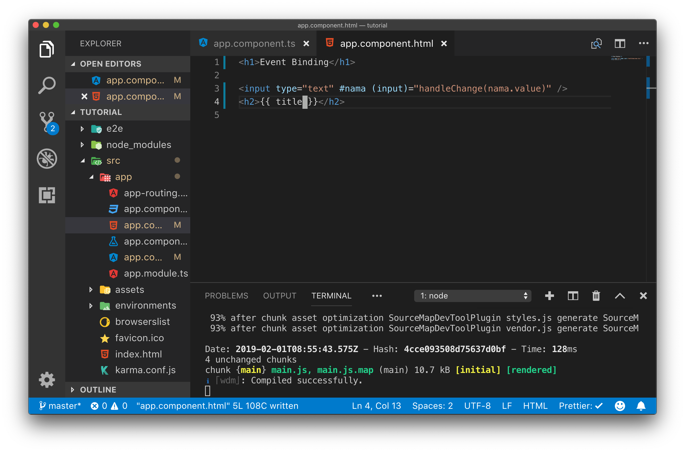
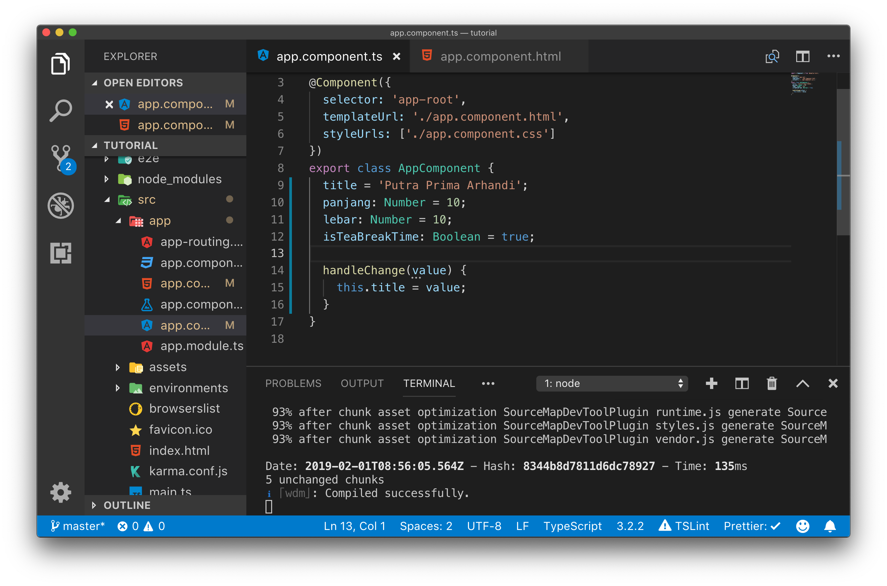
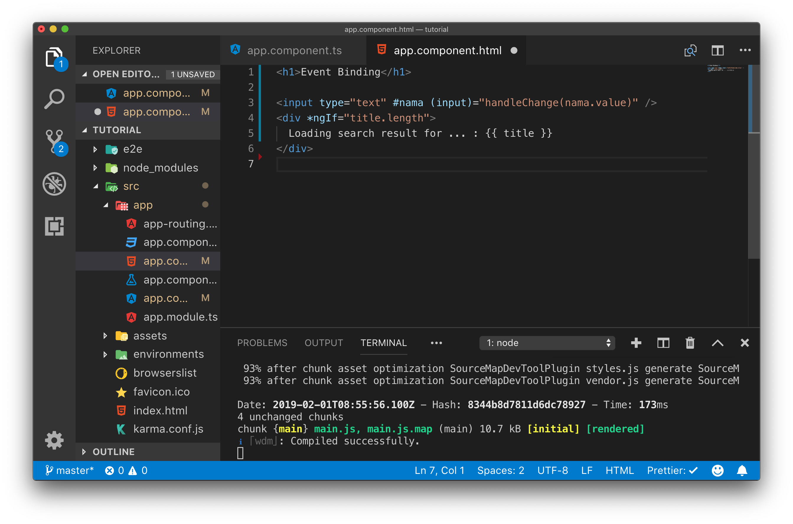
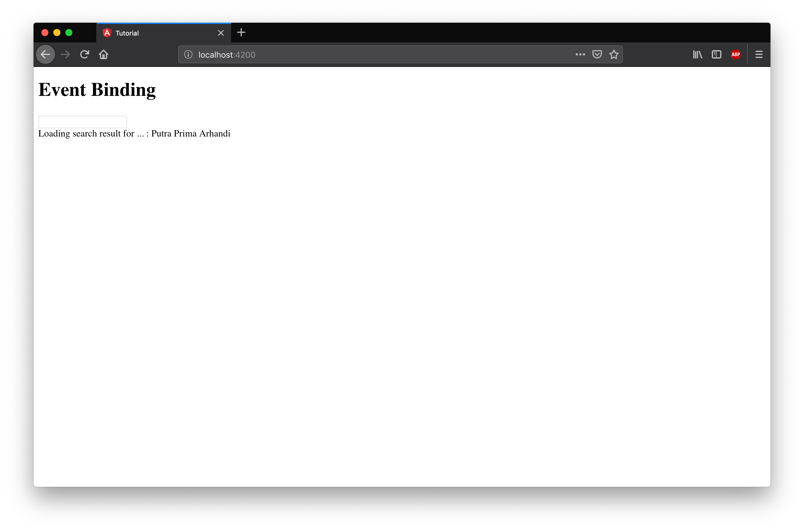
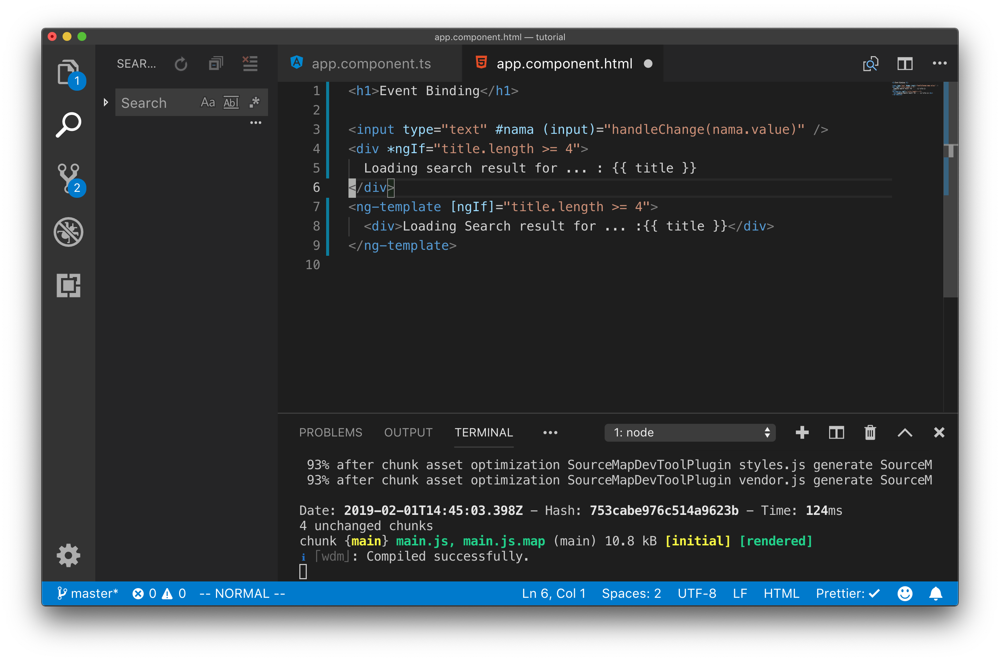
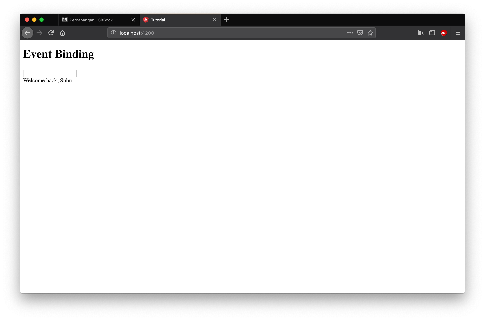

# Percabangan (ngIf)

Seperti bahasa pemrograman pada umumnya angular juga memiliki sintaks untuk melakukan percabangan. NgIf pada angular sama seperti percabangan pada bahasa pemrograman lain namun dengan template dan sintaks khusus pada template htmlnya. Untuk percabangan menggunakan ngIf khusus untuk percabangan pada file template html, untuk file class component percabangan nya menggunakan sintaks if seperti biasa.

## Langkah Percobaan

Untuk mempermudah pemahaman terhadap ngIf silahkan melakukan langkah percobaan berikut ini.

Dengan file yang ada dari percobaan sebelumnya modifikasilah sehingga input text yang di isi oleh user memiliki event `(input)`, hal ini dapat anda lakukan dengan mengubah event binding yang ada pada app.component.html yang sebelumnya `(blur)` menjadi `(input)` kemudian ubah lah handler pada event binding tersebut menjadi `handleChange()`



Selanjutnya kita sesuaikan nama fungsi di app.component.ts dengan perubahan yang kita lakukan di app.component.html.



Pada percobaan ini kita akan menampilkan sebuah elemen dom baru yang isinya merupakan input dari user di input text jika input tersebut sudah mencapai minimal 3 karakter. Hal ini dapat dilakukan dengan menggunakan directive ngIf.

Langkah selanjutnya adalah menambahkan directive ngIf ke template app.component.html.



Dengan menggunakan kode program di atas kita dapat membatasi div yang berisi informasi search result akan tampil jika variabel title memiliki nilai length.

Selanjutnya jalankanlah server angular dengan perintah `ng-serve` kemudian bukalah dengan web browser.



Cobalah untuk mengisi input kemudian perhatikan hasilnya.

## Challenge Time

> Pada saat anda menjalankan server pada awal start sudah muncul kata `Loading search result for ... : {{title}}` modifikasilah app.component.ts sehingga pada awal start kata kata tersebut tidak muncul. (hint: variabel title pada awal start server panjangnya harus 0)

> Challenge selanjutnya adalah membatasi munculnya kata `Loading search result for ... : {{title}}` hanya setelah user menginputkan 4 kata. (hint: ngIf bisa memiliki operator perbandingan di dalam argumen nya)

## ngIf , else , then, ngIfElse

Tidak hanya if statement yang dapat dipakai di template html angular, selain itu kita juga dapat menggunakan else dan then. Untuk memahaminya lakukanlah langkah percobaan dibawah ini

## Langkah Percobaan

Saat menggunakan `*ngIf` perhatikan bahwa ada tanda `*` pada dasarnya `*ngIf` adalah sugar syntax untuk mempermudah penulisan kode program.

Ubahlah kode program pada app.component.html menjadi seperti dibawah ini :


Jalankanlah server angular kemudian perhatikan bahwa kedua kode program `*ngIf` dan `<ng-template [ngIf]>` memberikan hasil yang sama


```html
<div *ngIf="title.length >= 4">Loading search result for ... : {{ title }}</div>
<ng-template [ngIf]="title.length >= 4">
  <div>Loading Search result for ... :{{ title }}</div>
</ng-template>
```

Dari percobaan diatas dapat dilihat bahwa penggunaan `*ngIf` adalah sugar syntax untuk `ng-template`

Dengan menggunakan `ng-template` kita dapat memperluas penggunaan ngIf dengan tambahan ngIfElse, then dan else.

Untuk mencobanya lakukan perubahan pada file app.component.ts dengan menambahkan satu variabel baru yaitu `isLoggedIn`


Selanjutnya tambahkan kode html berikut ini pada app.component.html.


Jalankan server angular kemudian perhatikan output yang dihasilkan.



Perhatikan pada tulisan `Welcome back, Suhu.` ini menunjukkan `ng-template` sudah dapat bekerja dengan baik karena output yang dihasilkan sesuai dengan nilai variabel `isLoggedIn` pada app.component.ts

## Challenge Time

> Cobalah merubah nilai `isLoggedIn` menjadi `false` kemudian perhatikan perubahan apa yang terjadi

> Ubah lah tulisan `Welcome back, Suhu.` menjadi sesuai dengan data yang dituliskan user pada input text.

Selain itu `ng-template` juga dapat digunakan dengan menggunakan sintaks `else` dan `then`

Untuk mencobanya silahkan ubah app.component.html menjadi seperti gambar dibawah ini.


Perhatikan pada kode program diatas ditambahkan tag `ng-container` dengan sugar syntax `*ngIf` dan tetap menggunakan `ng-template` untuk tampilan `then` dan `else` nya.
