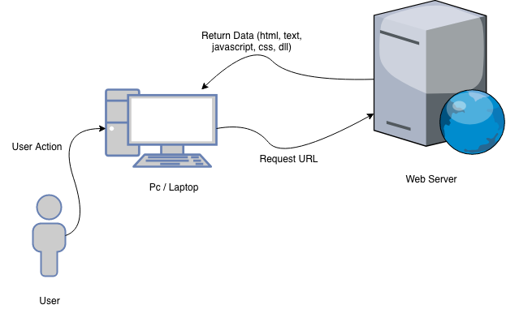
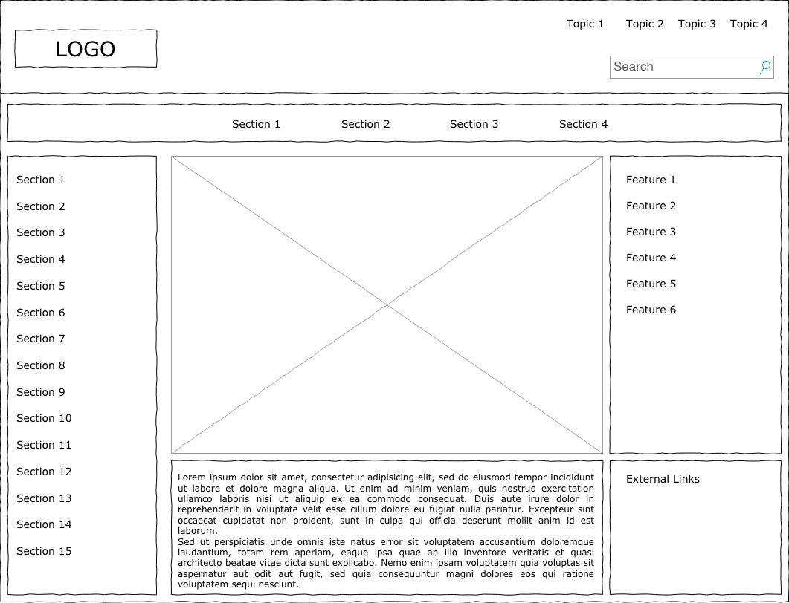

# Kemampuan Akhir Yang Diharapkan
1. Mahasiswa memahami konsep pembuatan frontend dengan angular.
2. Mahasiswa memahami perbedaan antara cara pembuatan frontend dengan angular dan html biasa.
3. Mahasiswa mampu memahami konsep "component" dalam pembuatan frontend.

# Pengenalan Angular

Angular adalah salah satu framework front end yang sedang populer saat ini, angular dikembangkan dengan bahasa pemrograman typescript.

## Angular vs Html
Teknik pembuatan frontend untuk saat ini sudah berkembang dengan sangat pesat, pada beberapa tahun yang lalu pembuatan front end masih menggunakan view yang di render oleh server. Teknik ini menggunakan bahasa pemrograman html untuk tampilan front end dan bahasa pemrograman server side untuk mengatur tampilan dan data.

Kemudian pada dua sampai tiga tahun terakhir pembuatan aplikasi web sudah mengarah kepada pembuatan sistem yang terbagi menjadi dua bagian yaitu back end dan front end. Angular berfokus di pengembangan front end sehingga front end yang pada beberapa tahun yang lalu hanya menampilkan data dari server sekarang sudah berubah tidak sekedar menampilkan data saja namun dapat diprogram sehingga lebih interaktif dan responsif.

## Konsep Pembuatan Front end Dengan Angular

Konsep pembuatan front end dengan angular sangat berbeda dengan pembuatan front end dengan html atau bahasa pemrograman server side biasa. Pada pembuatan front end dengan angular konsep yang sangat penting untuk dipahami adalah  “Segala sesuatu yang dapat dilihat oleh user dibagi sebagai sebuah komponen”. Komponen ini dapat digunakan kembali dan dapat dikombinasikan dengan komponen lain sehingga dapat menjadi sebuah halaman yang dapat digunakan oleh user.

## Konsep Dasar Angular

### Modules
### Component
### Services 
### Directives 
### Routing 

## Tugas