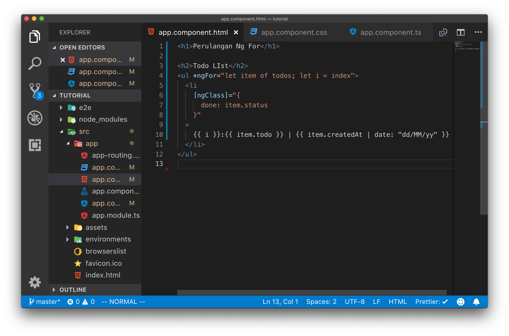
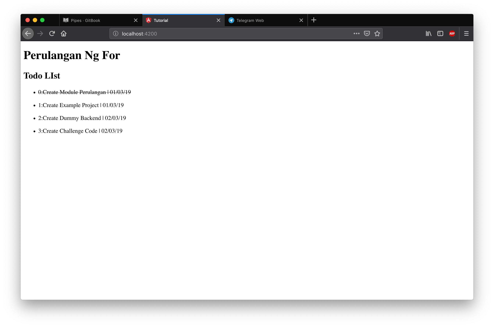

# Pipes

Pipes adalah sebuah fungsi sederhana yang bertugas melakukan transformasi data / input menjadi data yang terformat sesuai dengan yang dibutuhkan.

Contoh Pipes sederhana adalah pipes untuk memformat tanggal. Pada umumnya format tanggal pada database atau rest api disimpan dalam bentuk sebuah date time format. Untuk menampilkan ke user format ini harus diubah ke format yang sesuai dengan keinginan user.

Untuk memahami cara penggunakan pipes ikutilah langkah percobaan dibawah ini

## Langkah Percobaan

Ubahlah variabel `todos` pada app.component.ts menjadi seperti pada gambar dibawah ini.

Pada kode program diatas kita melakukan perubahan pada object Todos menjadi memiliki properties `createdAt` yang memiliki tipe data date.

Selanjutnya lakukan perubahan pada file template app.component.html menjadi seperti pada gambar dibawah ini :

Pada kode program diatas kita menambahkan tanggal dibuatnya todo list dengan menampilkan `item.createdAt`

jalankan server angular dan lihatlah hasilnya pada web browser.

Pada gambar di atas kita sudah bisa menampilkan tanggal dibuatnya todo, namun formatnya masih tidak familiar bagi user. Untuk memperbaiki hal ini tambahkan pipes pada app.component.html

Pada kode porgram diatas kita menambahkan pipes dengan menambahkan sintaks `| date : 'dd/MM/yy'`

Selanjutnya silahkan buka browser dan hasilnya tanggal yang sebelumnya tidak terformat rapi sudah berubah menjadi format d/m/y yang sesuai dengan user di indonesia.

