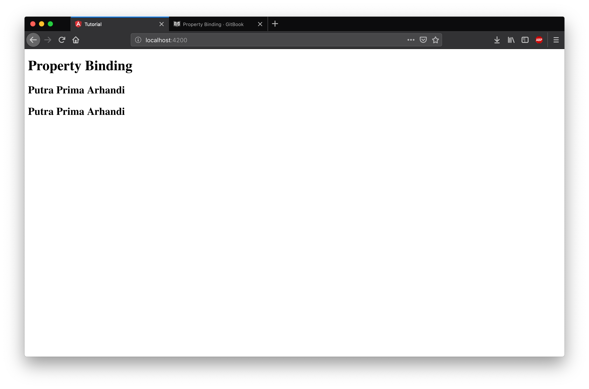

# Property Binding

Property binding adalah cara angular untuk menghubungkan antara tag attribute pada template html dan variabel class component. Untuk mempermudah pemahaman terhadap property binding ada beberapa konsep yang harus dipahami yaitu :

1. Semua tag html memiliki attribut.
2. Semua attribut pada tag html tersebut dapat di akses melalui Document Object Model (Dom).
3. Semua Dom memiliki properties yang sesuai dengan attribut pada tag html tersebut.

> Untuk yang sudah berpengalaman dengan akses DOM menggunakan jquery atau javascript mungkin dapat lebih mudah memahami konsep ini

Contoh :

```html
<!-- kode program html biasa: -->
<input type="text" value="hello world" />
<!-- kode program property binding pada atribut html: -->
<input type="text" [value]="namaVariabelDiComponent" />
<!-- kode program property binding pada interpolasi pada html: -->
<input type="text" value="{{namaVariabelDiComponent}}" />
```

Dengan potongan kode program di atas kita melakukan property binding ke attribut value dari input text. Dengan cara ini kita dapat menghubungkan nilai variabel dengan nama "namaVariabelDiComponent" ke isi dari input text.

Selain dengan menggunakan `[]` (square bracket) property binding juga bisa dilakukan dengan menggunakan interpolasi seperti pada kode program di atas, namun cara yang umum dan sering digunakan adalah cara pada kode program baris ke dua.

Property binding dengan cara ini merupakan model "one way data binding" dimana data mengalir satu arah dari component ke template, artinya data hanya akan berubah jika component mengubah nilai dari data tersebut template html hanya menjadi presenter atau alat untuk menampilkan data.

## Langkah Percobaan

Dari percobaan sebelumnya hapuslah isi dari file app.component.html, kemudian berilah sebuah header dengan judul "Property Binding"


Selanjutnya lakukan lah binding terhadap sebuah tag html h2 yang berisi nilai dari variabel title pada component dengan cara property binding dan interpolasi.


Hasil dari kode program diatas



Dari hasil percobaan diatas terlihat binding dengan cara property binding dan interpolasi memberikan hasil yang sama.

Selanjutnya buatlah sebuah tombol dengan binding attribut disabled nya ke variabel `isTeaBreakTime` seperti pada kode program dibawah ini.


Jalankan server angular anda dan lihat hasilnya pada web browser.


Perhatikan bahwa hasil binding menggunakan interpolasi pada button selalu membuat button di disable.

> Interpolasi dapat digunakan sebagai property binding karena interpolasi merupakan syntactic sugar untuk mempersingkat penulisan binding, namun tidak dapat digunakan untuk nilai boolean jadi sebaiknya jika tipe data yang di binding bukan string di binding menggunakan property binding saja.
