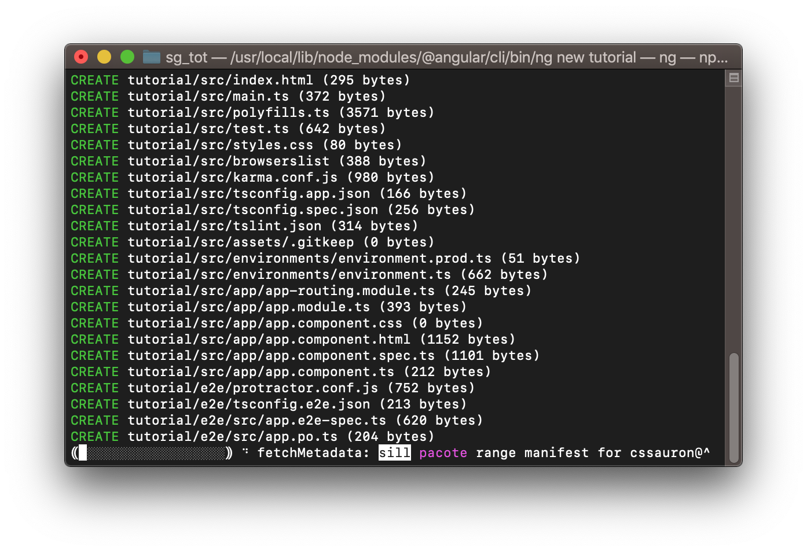
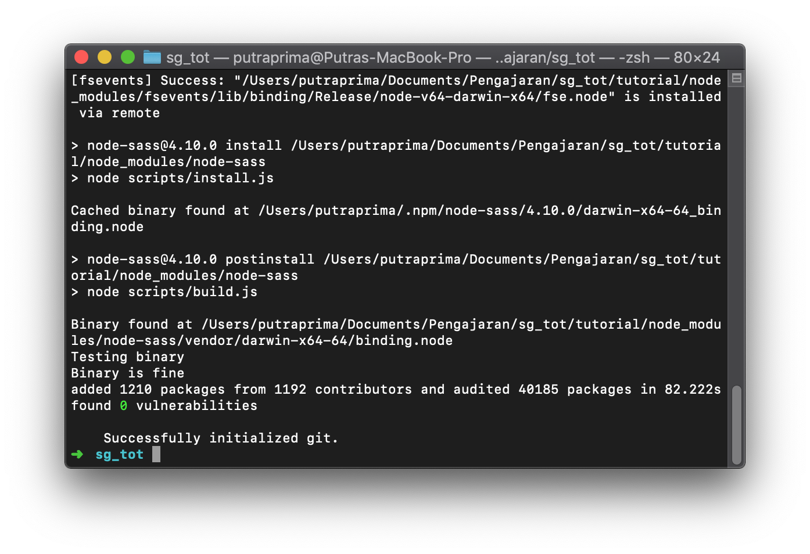

# Struktur File Pada Project Angular

Untuk memulai membuat project angular dapat dilakukan dengan membuat sebuah project baru menggunakan angular cli, untuk membuat project dengan angular cli ikutilah langkah langkah percobaan dibawah ini

## Langkah percobaan

Ketikkan perintah berikut ini pada terminal anda

```
ng new tutorial
```


Setelah ng new tutorial dijalankan angular cli akan meminta anda memilih untuk menambahkan routing module atau tidak, untuk saat ini pilih Y untuk menambahkan routing module


Selanjutnya angular cli akan meminta anda untuk memilih format stylesheet yang akan digunakan pilihlah css sebagai stylesheetnya.


Proses selanjutnya angular cli akan mendownload dan menginstall dependency yang dibutuhkan. Tunggulah proses ini sampai selesai



Berikut ini tampilan terminal ketika proses install sudah selesai



Untuk langkah selanjutnya silahkan buka folder tutorial yang sudah dibuat dengan menggunakan visual studio code atau editor yang anda kuasai.


Di editor ini anda dapat melihat struktur file yang dimiliki oleh angular v.7 pada dasarnya struktur file ini masih sama dengan yang dimiliki oleh angular v6.

Didalam folder src terdapat folder app yang berisi module dan component, nanti pada pembelajaran selanjutnya kita akan mengubah dan menambah component serta module di dalam folder ini. Untuk tahap awal pembelajaran angular kita akan lebih sering bekerja di folder app.
