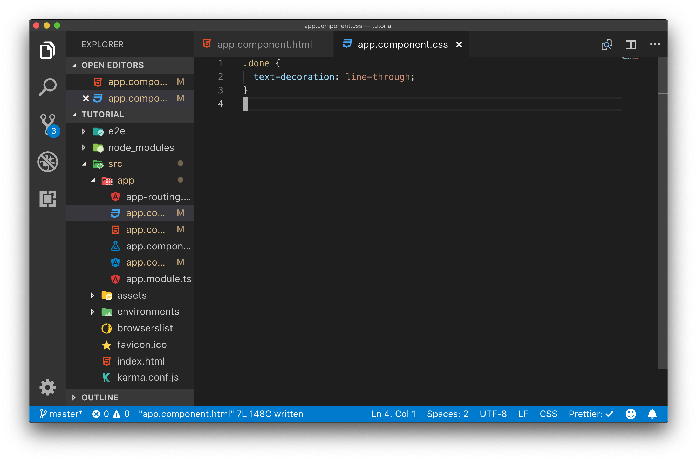
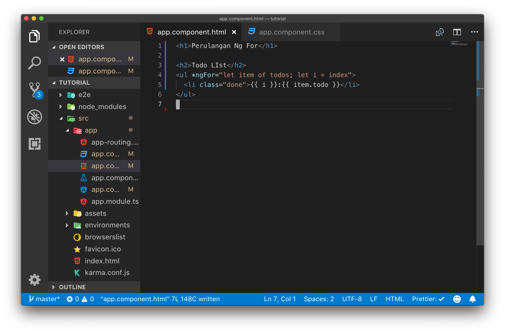

# Style Binding

Pada angular untuk menerapkan suatu style kepada sebuah tag html dapat digunakan beberapa opsi antara lain :

1. ngStyle
2. ngClass

## ngStyle

ngStyle digunakan untuk melakukan binding sebuah style ke tag html dengan format css, memanfaatkan javascript properties yang sesuai dengan style css yang bisa dipasang pada sebuah tag. Dengan menggunakan ngStyle kita menulis style nya di template html penulisan style dengan ngStyle ini mirip dengan proses inline style pada html.

## ngClass

ngClass digunakan untuk melakukan binding sebuah class css ke sebuah tag html, dalam menggunakan ngClass kita menulis class nya di file style dari sebuah component kemudian membinding nya ke tag html

## Langkah Percobaan

Untuk memahami penggunaan `ngStyle` dan `ngClass` lakukanlah langkah percobaan dibawah ini :

Bukalah file app.component.css kemudian tambahkan class css seperti pada gambar berikut ini :

Kemudian bukalah file app.component.html lalu tambahkan class `.done` pada tag `li`

Kemudian buka lah aplikasi angular melalui web, pada saat ini anda akan melihat semua task dalam todo list sudah berubah menjadi text yang tercoret, karena dipasang sebuah css `text-decoration: line-through`

Selanjutnya modifikasi file app.component.html untuk menampilkan `text-decoration:line-through` hanya jika todo memiliki status `true` hal ini dapat dilakukan dengan menambahkan binding `ngClass` pada tag `li` seperti pada gambar dibawah ini.

Pada kode program di atas kita menambahkan binding ke `ngClass` dimana argumen dari untuk `ngClass` ini berupa sebuah object, maka kita memberikan properties `done` sesuai dengan value dari `todo.status`

Hal yang sama dapat dilakukan dengan menggunakan sintaks `ngStyle` untuk mencoba tambahkan kode program ini ke app.component.html anda.

pada kode program di atas kita melakukan binding dengan menggunakan `ngStyle` khusus binding dengan `ngStyle` ini kita menggunakan object yang properties nya adalah properties css dan nilai nya adalah nilai dari css nya bukan class css yang kita buat sebelumnya.
