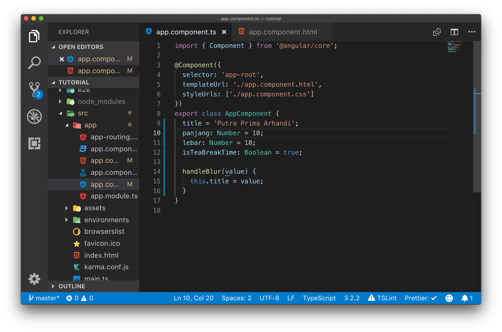
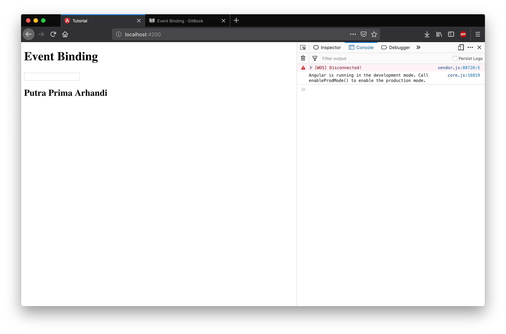

# Template Reference

Template Reference adalah cara untuk mempermudah akses terhadap binding kepada suatu element.

## Langkah Percobaan

Ubahlah kode program pada file app.component.html dengan menambahkan template ref dengan nama `#nama` pada input text. Dan ganti lah parameter pada fungsi handleBlur().

Selanjutnya ubah lagi kode program pada app.component.ts dengan mengganti fungsi handleBlur.

Dengan kode program yang lebih rapi menggunakan template ref kita mendapatkan hasil yang sama pada halaman web.

