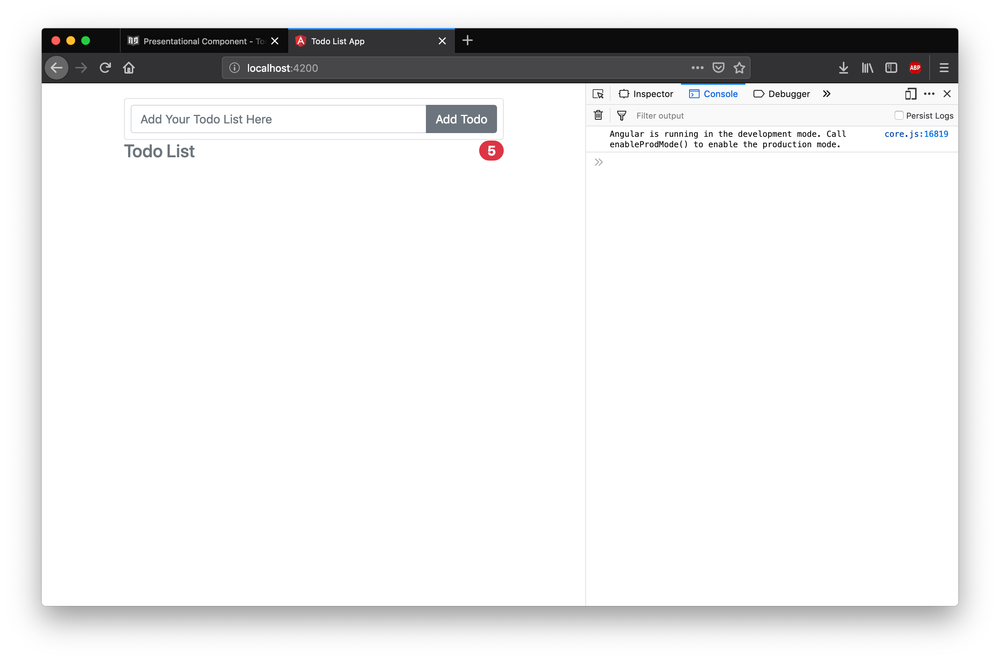
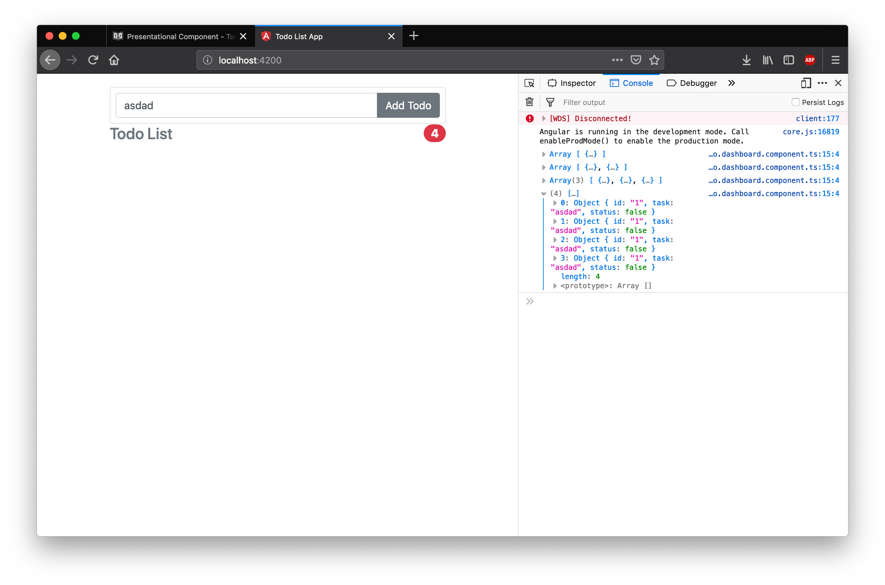

# TodoCountComponent
Selanjutnya kita akan menyelesaikan langkah selanjutnya yaitu membuat presentational component TodoCountComponent. Presentational component ini mempunyai tugas menampilkan jumlah todo yang sudah selesai atau belum selesai. Untuk menyelesaikan component ini lakukanlah langkah percobaan dibawah ini.

Sesuai dengan desain pada chapter sebelumnya berdasarkan tabel dibawah ini

| Component          |  Input   | Output / Event Emitter |
| ------------------ | :------: | ---------------------: |
| TodoCountComponent | Todos[ ] |                      - |
| TodoItemComponent  |   Todo   |         ToggleFinished |
| AddTodoComponent   |    -     |                AddTodo |

TodoCountComponent memiliki input yang bertujuan untuk menghitung Todo yang sudah selesai (finished) atau belum. 

## Buat Boilerplate TodoCountComponent
Bukalah file `todo.count.component.ts` dan tambahkan kode program berikut ini 
```typescript
import { Component, Input } from '@angular/core';
@Component({
  selector: 'todo-count',
  styleUrls: [],
  templateUrl: 'todo.count.html'
})
export class TodoCountComponent {
  constructor() {}
}
```
Pada kode program diatas dibuat sebuah boilerplate untuk TodoCountComponent dan yang berbeda dengan AddTodoComponent adalah ditambahkan import untuk Input, dimana input ini adalah decorator yang menyatakan bahwa suatu variabel merupakan input untuk component tersebut.

## Buat Tampilan Todo Count Component
Tampilan untuk component ini adalah tampilan yang menunjukkan perhitungan jumlah todo yang sudah selesai atau belum.

```html
<h4 class="d-flex justify-content-between align-items-center mb-3">
  <span class="text-muted">Todo List</span>
  <span class="badge badge-danger badge-pill">5</span>
</h4>
```
## Register Component ke TodoDashboardModule
Selanjutnya daftarkan component ini ke module dengan cara mengimportnya dan menambahkan ke declaration.

```typescript
import { NgModule } from '@angular/core';
import { CommonModule } from '@angular/common';

import { TodoDashboardComponent } from './containers/todo.dashboard.component';
import { AddTodoComponent } from './component/add-todo/add.todo.component';
import { TodoCountComponent } from './component/todo-count/todo.count.component';

@NgModule({
  declarations: [TodoDashboardComponent, AddTodoComponent, TodoCountComponent],
  imports: [CommonModule],
  exports: [TodoDashboardComponent]
})
export class TodoDashboardModule {}

```
## Aktifkan Selector todo-count di TodoDashboard
Bukalah file todo.dashboard.html kemudian aktifkan selector todo-count
```html
<div class="row">
  <div class="col-md-12 order-md-2 mb-4">
    <add-todo (create)="handleAddTodo($event)"></add-todo>
    <todo-count></todo-count>
    <!-- <todo-item></todo-item>  -->
  </div>
</div>
```
Jika server dijalankan pada kondisi ini tampilan yang didapat seperti gambar dibawah ini, namun ketika diberikan input masih belum memberikan respon apapun terhadap todo count karena belum diberikan input dari todo dashboard.


## Input Parameter Ke TodoCountComponent
Berilah input dari variabel `todoList` ke component TodoCount dengan menambahkan sebuah property binding di file `todo.dashboard.html`
```html
<div class="row">
  <div class="col-md-12 order-md-2 mb-4">
    <add-todo (create)="handleAddTodo($event)"></add-todo>
    <todo-count [todos]="todoList"></todo-count>
    <!-- <todo-item></todo-item>  -->
  </div>
</div>
```
## Update TodoCountComponent Untuk Menerima Input
PAda langkah sebelumnya sudah di import input decorator namun di kode program sebelumnya decorator ini belum digunakan, selanjutnya gunakanlah decorator ini agar TodoItemComponent dapat menerima input dari TodoDashboardComponent.

```typescript
import { Component, Input } from '@angular/core';
import { Todo } from '../../models/todo.model';
@Component({
  selector: 'todo-count',
  styleUrls: [],
  templateUrl: 'todo.count.html'
})
export class TodoCountComponent {
  @Input()
  todos: Todo[];
  constructor() {}
}
```

Pada kode program di atas ditambahakan terlebih dahulu import model Todo dan ditambahkan decorator input todo.

## Menghitung Todo finished / unfinished di TodoCountComponent

Untuk menghitung jumlah todo dapat dilakukan dengan menambahkan interpolasi untuk menampilkan size dari variabel todos pada component TodoCount.

```html
<h4 class="d-flex justify-content-between align-items-center mb-3">
  <span class="text-muted">Todo List</span>
  <span class="badge badge-danger badge-pill">{{ todos.length }}</span>
</h4>
```

Jalankan server dan perhatikan perubahan yang terjadi jika anda menambahkan todo.

