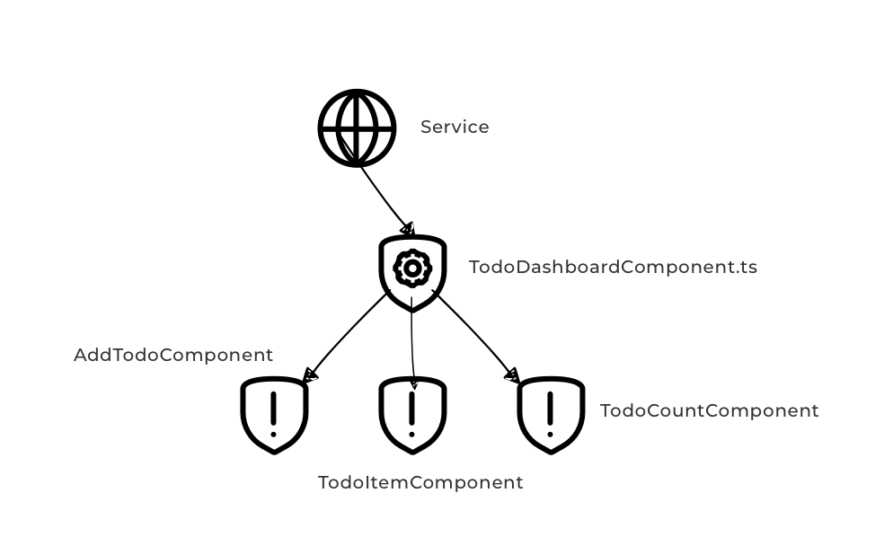

# Container Component Todo Dashboard

Selanjutnya kita akan membuat container component sesuai dengan hasil analisa pada bab sebelumnya seperti pada gambar dibawah ini.



Pada component tree di atas dapat anda lihat bahwa terdapat 4 component dengan TodoDashboardComponent menjadi container dengan 3 presentational component yaitu AddTodoComponent, TodoItemComponent, dan TodoCountComponent. Pada percobaan kali ini kita akan membuat item item pada component tree tersebut dimulai dari TodoDashboardComponent.

## Langkah Percobaan

Langkah pertama siapkan sebuah struktur folder untuk menyimpan file file yang dibutuhkan berdasarkan component tree yang sudah di desain.

```
└── todo-dashboard
    ├── component
    │   ├── add-todo
    │   │   ├── add.todo.component.ts
    │   │   └── add.todo.html
    │   ├── todo-count
    │   │   ├── todo.count.component.ts
    │   │   └── todo.count.html
    │   └── todo-item
    │       ├── todo.item.component.ts
    │       └── todo.item.html
    ├── containers
    │   ├── todo.dashboard.component.ts
    │   ├── todo.dashboard.css
    │   └── todo.dashboard.html
    ├── models
    │   └── todo.model.ts
    └── todo.dashboard.modules.ts
```


Seperti pada gambar dan folder tree di atas buatlah sebuah tiga buah folder yaitu :

- component
- containers
- models

di dalam folder todo-dashboard, setelah itu di dalam folder component siapkan folder lain untuk menyimpan file file yang digunakan untuk presentational component :

- add-todo
- todo-count
- todo-item

Di dalam folder containers siapkan file untuk container component `TodoDashboardComponen`. Setelah semua folder dibuat lengkapi folder tersebut dengan file file yang ada di file tree, biarkan file tersebut kosong tapi dengan ekstensi file yang sesuai.
