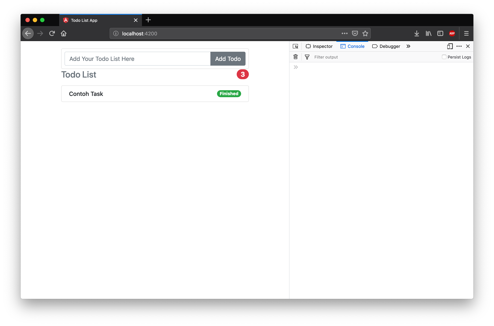
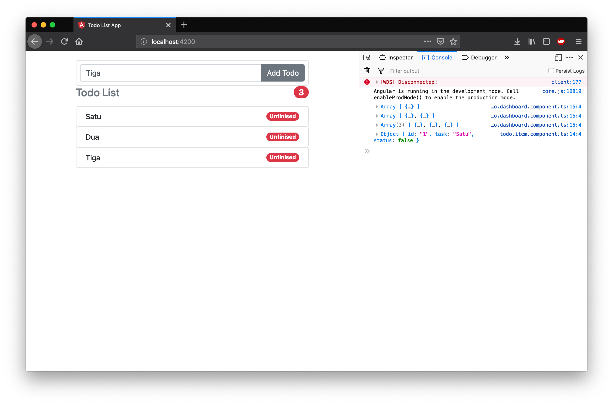

# TodoItemComponent 
Selanjutnya kita akan menyelesaikan component selanjutnya yaitu presentational component TodoItemComponent. Presentational component ini mempunyai tugas menampilkan satu item todo dengan sebuah button yang dapat mengubah status todo dari finished ke unfinished.

Buatlah TodoItemComponent sesuai dengan desain pada chapter sebelumnya berdasarkan tabel dibawah ini

| Component          |  Input   | Output / Event Emitter |
| ------------------ | :------: | ---------------------: |
| TodoCountComponent | Todos[ ] |                      - |
| TodoItemComponent  |   Todo   |         ToggleFinished |
| AddTodoComponent   |    -     |                AddTodo |

TodoItemComponent memiliki satu input Todo dan satu Output ToggleFinished. Untuk menyelesaikannya lakukanlah langkah percobaan berikut ini.

## Boilerplate TodoItemComponent
Bukalah file todo.item.component.ts kemudian tambahkan kode program berikut ini.
```typescript
import { Component, Input, Output, EventEmitter } from '@angular/core';
import { Todo } from '../../models/todo.model';
@Component({
  selector: 'todo-item',
  styleUrls: [],
  templateUrl: 'todo.item.html'
})
export class TodoItemComponent {
  constructor() {}
}
```

Pada kode program diatas dilakukan import terhadap component, input, output dan eventemitter hal ini dilakukan karena pada component ini memiliki keduanya baik input maupun output.

## Tampilan
Tampilan todo item berisi keterangan todo dan status dari todo tersebut baik finished maupun unfinished, bukalah file todo.item.html kemudian isikan kode program berikut.

```html
<li class="list-group-item d-flex justify-content-between lh-condensed">
  <div>
    <h6 class="my-0">Contoh Task</h6>
  </div>
    <span class="badge badge-success badge-pill"
      >Finished</span
    >
</li>
```

Tampilan ini berisi item task dan badge finished, nanti berdasarkan data yang diberikan dari todoDashboard todoItem akan merender satu item berdasarkan data tersebut

## Register ke module
Selanjutnya dengan component yang sudah dibuat daftarkan component ini ke module todo.dashboard.module. 

```typescript
import { NgModule } from '@angular/core';
import { CommonModule } from '@angular/common';

import { TodoDashboardComponent } from './containers/todo.dashboard.component';
import { AddTodoComponent } from './component/add-todo/add.todo.component';
import { TodoCountComponent } from './component/todo-count/todo.count.component';
import { TodoItemComponent } from './component/todo-item/todo.item.component';

@NgModule({
  declarations: [
    TodoDashboardComponent,
    AddTodoComponent,
    TodoCountComponent,
    TodoItemComponent
  ],
  imports: [CommonModule],
  exports: [TodoDashboardComponent]
})
export class TodoDashboardModule {}
```

## Aktifkan selector
Setelah melakukan registrasi component, lanjutan dengan mengaktifkan selector todo-item di todo.dashboard.html.

```html
<div class="row">
  <div class="col-md-12 order-md-2 mb-4">
    <add-todo (create)="handleAddTodo($event)"></add-todo>
    <todo-count [todos]="todoList"></todo-count>
    <todo-item></todo-item> 
  </div>
</div>
```

Pada kode program diatas dibuat import todoItemComponent dan ditambahkan ke declarations. Jika dijalankan sekarang server akan memberikan tampilan sebagai berikut.


## Looping dan Input Parameter
Karena data dari TodoDashboardComponent berupa list of task maka diperlukan sebuah perulangan untuk menampilkan semua data todo yang ada. Untuk itu ubahlah kode program pada todo.dashboard.html menjadi seperti dibawah ini.

```html
<div class="row">
  <div class="col-md-12 order-md-2 mb-4">
    <add-todo (create)="handleAddTodo($event)"></add-todo>
    <todo-count [todos]="todoList"></todo-count>
    <todo-item *ngFor="let todo of todoList"></todo-item>
  </div>
</div>
```


Jika server dijalankan dapat dilihan jumlah todoitem bertambah sesuai degnan jumlah input yang kita berikan namun belum memiliki data yang sesuai degan input yang kita berikan.

## Update Todo Item Untuk terima input
Agar data sesuai dengan input diperlukan cara agar data dari TodoDashboard terhubung ke TodoItem, hal ini dapat dilakukan dengan memberikan input ke TodoItem dengan membuat property binding di file todo.dashboard.html ke selector todo-item.

```html
<div class="row">
  <div class="col-md-12 order-md-2 mb-4">
    <add-todo (create)="handleAddTodo($event)"></add-todo>
    <todo-count [todos]="todoList"></todo-count>
    <todo-item *ngFor="let todo of todoList" [item]="todo"></todo-item>
  </div>
</div>
```

TodoItem harus memiliki decorator input agar dapat menerima input dari todo dashboard.

```typescript
import { Component, Input, Output, EventEmitter } from '@angular/core';
import { Todo } from '../../models/todo.model';
@Component({
  selector: 'todo-item',
  styleUrls: [],
  templateUrl: 'todo.item.html'
})
export class TodoItemComponent {
  @Input()
  item: Todo;
  constructor() {}
}
```
Setelah mendapatkan input modifikasi file todo.item.html sehingga dapat memanfaatkan input item dari todoDashboard.

```html
<li class="list-group-item d-flex justify-content-between lh-condensed">
  <div>
    <h6 class="my-0">{{ item.task }}</h6>
  </div>
  <span class="badge badge-success badge-pill">Finished</span>
</li>
```


Selanjutnya modifikasi dengan menambahkan template untuk membedakan tampilan todo ketika finished atau unfinished.

```html
<li class="list-group-item d-flex justify-content-between lh-condensed">
  <div>
    <h6 class="my-0">{{ item.task }}</h6>
  </div>
  <ng-container
    *ngIf="item.status; then finished; else unfinished"
  ></ng-container>
  <ng-template #finished>
    <span class="badge badge-success badge-pill"
      >Finished</span
    >
  </ng-template>
  <ng-template #unfinished>
    <span class="badge badge-danger badge-pill" 
      >Unfinised</span
    >
  </ng-template>
</li>
```


Sejauh ini kita sudah berhasil menambahkan todo dan menampilkan statusnya, selanjutnya berikan event click pada todoitem sehingga dapat mengirimkan data ke tododashboard dan mengubah status todo dari unfinished ke finished atau sebaliknya.

## Buat Event Click di TodoItem
Untuk membuat event dilakukan dengan menambahkan event binding di file todo.item.html dan membuat handler nya di file todo.item.component.ts

```html
<li class="list-group-item d-flex justify-content-between lh-condensed">
  <div>
    <h6 class="my-0">{{ item.task }}</h6>
  </div>
  <ng-container
    *ngIf="item.status; then finished; else unfinished"
  ></ng-container>
  <ng-template #finished>
    <span class="badge badge-success badge-pill" (click)="onStatusClick(item)"
      >Finished</span
    >
  </ng-template>
  <ng-template #unfinished>
    <span class="badge badge-danger badge-pill" (click)="onStatusClick(item)"
      >Unfinised</span
    >
  </ng-template>
</li>
```

```typescript
import { Component, Input, Output, EventEmitter } from '@angular/core';
import { Todo } from '../../models/todo.model';
@Component({
  selector: 'todo-item',
  styleUrls: [],
  templateUrl: 'todo.item.html'
})
export class TodoItemComponent {
  @Input()
  item: Todo;
  constructor() {}

  onStatusClick(todo: Todo) {
    console.log(todo);
  }
}
```

Pada kode program di atas kita melakukan event click sehingga ketika di click akan menampilkan item todo yang di click di console.


## Buat Output / Event Emitter dari Todo Item
```typescript
import { Component, Input, Output, EventEmitter } from '@angular/core';
import { Todo } from '../../models/todo.model';
@Component({
  selector: 'todo-item',
  styleUrls: [],
  templateUrl: 'todo.item.html'
})
export class TodoItemComponent {
  @Input()
  item: Todo;

  @Output()
  status: EventEmitter<any> = new EventEmitter();

  constructor() {}

  onStatusClick(todo: Todo) {
    this.status.emit(todo);
  }
}

```
Pada kode program di atas ditambahkan output bernama status yang memiliki tipe data EventEmitter, kemudian pada fungsi onStatusClick output ini di emmit melalui event emitter.

## Buat Event Binding di Selector TodoDAshboard 
Agar output yang di emmit oleh TodoItem dapat diterima oleh TodoDashboard maka pada todo.dashboard.html perlu ditambahkan event binding pada selector todo-item.

```html
<div class="row">
  <div class="col-md-12 order-md-2 mb-4">
    <add-todo (create)="handleAddTodo($event)"></add-todo>
    <todo-count [todos]="todoList"></todo-count>
    <todo-item
      *ngFor="let todo of todoList"
      [item]="todo"
      (status)="handleToggleFinished($event)"
    ></todo-item>
  </div>
</div>
```

Pada kode program diatas ditambahkan event binding status dan membutuhkan handlerToggleFinished oleh karena itu tambahkan fungsi ini di todo.dashboard.ts

```typescript
import { Component } from '@angular/core';

import { Todo } from '../models/todo.model';
@Component({
  selector: 'todo-dashboard',
  styleUrls: ['todo.dashboard.css'],
  templateUrl: 'todo.dashboard.html'
})
export class TodoDashboardComponent {
  todoList: Todo[] = [];

  handleAddTodo(task: string) {
    const itemTodo = new Todo('1', task, false);
    this.todoList.push(itemTodo);
    console.log(this.todoList);
    return false;
  }

  handleToggleFinished(todo: Todo) {
    console.log(this.todoList);
    return (todo.status = !todo.status);
  }
}
```

Jika server dijalankan anda sudah dapat mengubah status todo dari unfinished ke finished dengan mengclik tombol unfinished.

